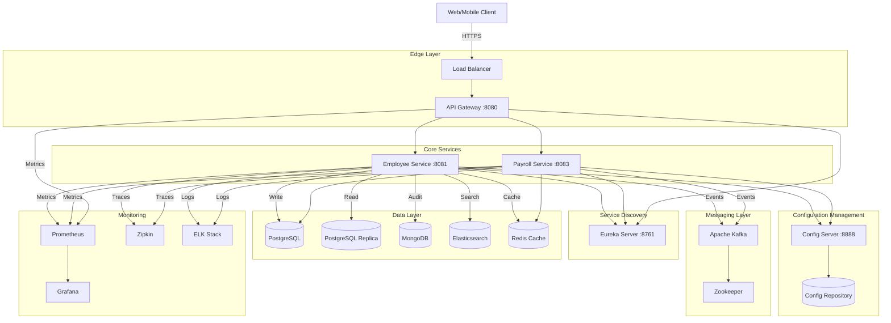
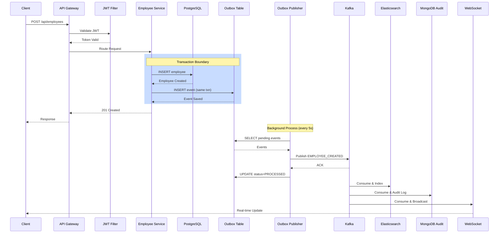
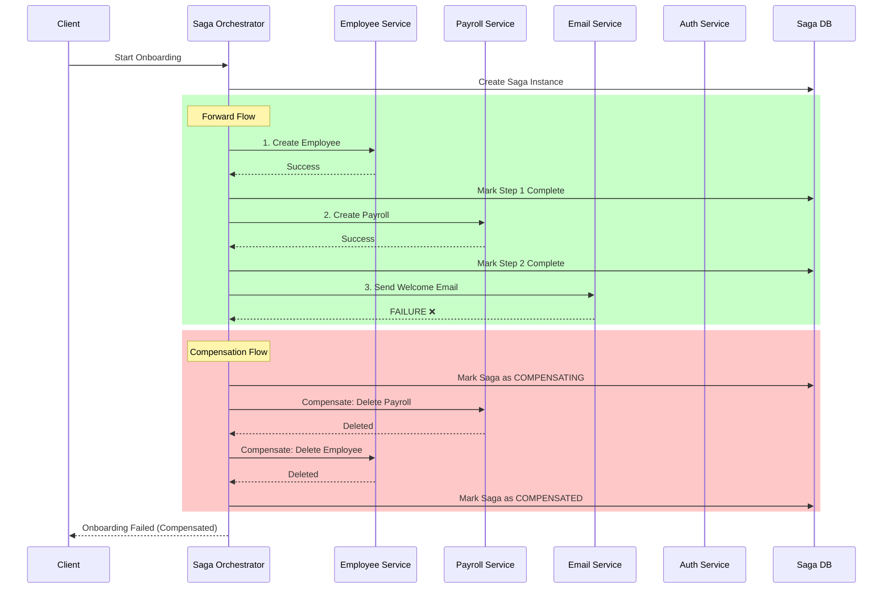
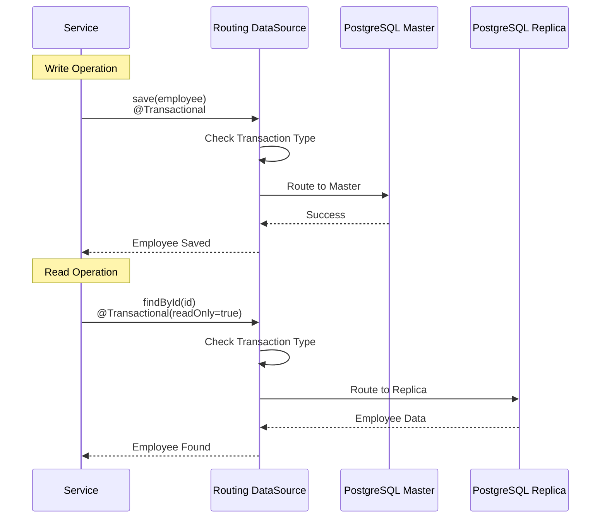
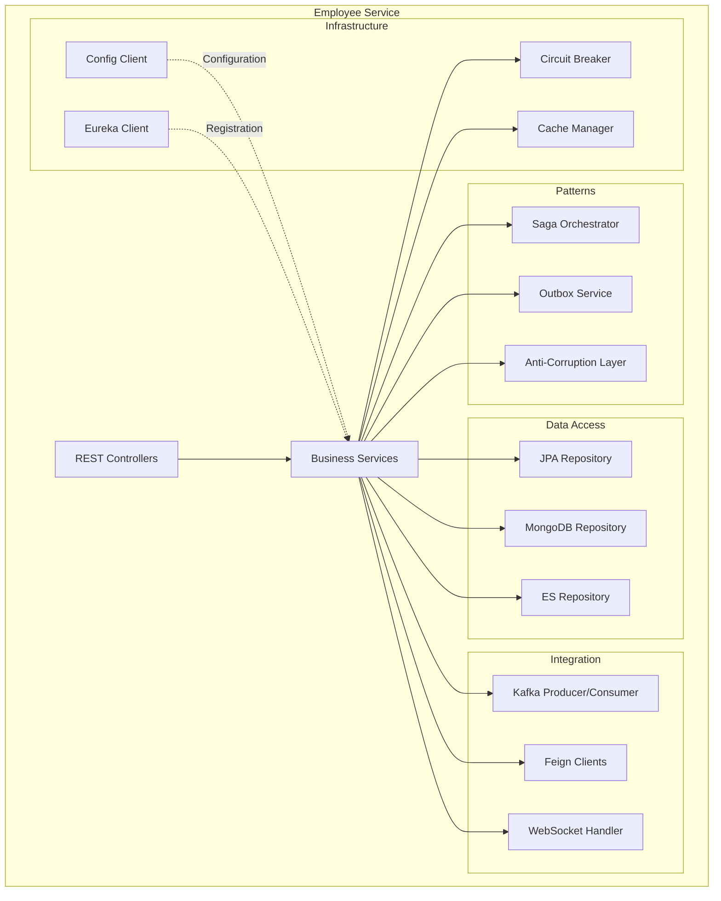
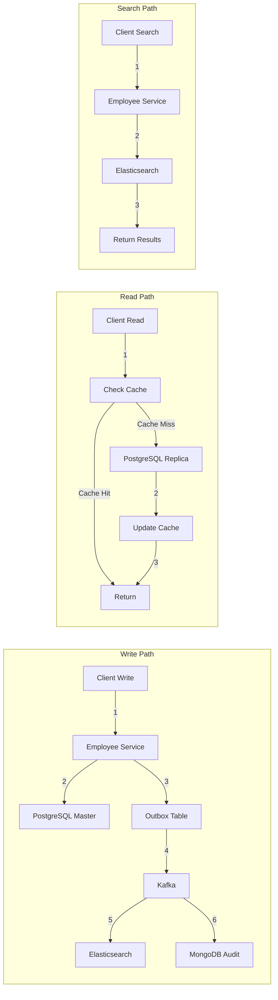

# System Architecture Diagram - Employee Management Platform

## High-Level Architecture



## Request Flow Sequence

### Employee Creation Flow



### Saga Pattern: Employee Onboarding



### Database Read/Write Routing



## Component Architecture - Employee Service



## Deployment Architecture

```mermaid
graph TB
    subgraph "Kubernetes Cluster"
        subgraph "Ingress"
            Ingress[Nginx Ingress Controller]
        end
        
        subgraph "Services Namespace"
            Gateway[API Gateway Pod x3]
            Employee[Employee Service Pod x3]
            Payroll[Payroll Service Pod x3]
            Config[Config Server Pod x2]
            Eureka[Eureka Server Pod x2]
        end
        
        subgraph "Data Namespace"
            PG[PostgreSQL StatefulSet]
            PGReplica[PG Replica StatefulSet]
            Mongo[MongoDB StatefulSet]
            ES[Elasticsearch StatefulSet]
            Redis[Redis StatefulSet]
        end
        
        subgraph "Messaging Namespace"
            Kafka[Kafka StatefulSet x3]
            ZK[Zookeeper StatefulSet x3]
        end
        
        subgraph "Monitoring Namespace"
            Prom[Prometheus]
            Graf[Grafana]
            Zip[Zipkin]
        end
    end
    
    subgraph "External"
        Users[End Users]
        DevOps[DevOps Team]
    end
    
    Users -->|HTTPS| Ingress
    Ingress --> Gateway
    Gateway --> Employee
    Gateway --> Payroll
    
    DevOps -->|Monitoring| Graf
    DevOps -->|Tracing| Zip
```

## Data Flow Architecture



This comprehensive architecture demonstrates:
- **Microservices**: Independent, scalable services
- **Event-Driven**: Kafka for async communication
- **Polyglot Persistence**: Right database for each use case
- **Resilience**: Circuit breakers, retries, fallbacks
- **Observability**: Prometheus, Grafana, Zipkin, ELK
- **Scalability**: Load balancing, read replicas, caching
- **Patterns**: Saga, Outbox, ACL, Strangler Fig
