# System Architecture Diagrams — Employee Platform (v2)

> **7 microservices · 98 technologies · 49 design patterns**
> Updated: February 2026 — includes analytics-service (gRPC), Debezium CDC, OpenTelemetry (OTLP), Event Sourcing Snapshots, MDC TaskDecorator, Redis KeyResolver rate limiting, WebSocket React hook.

---

## 1. Full System Architecture

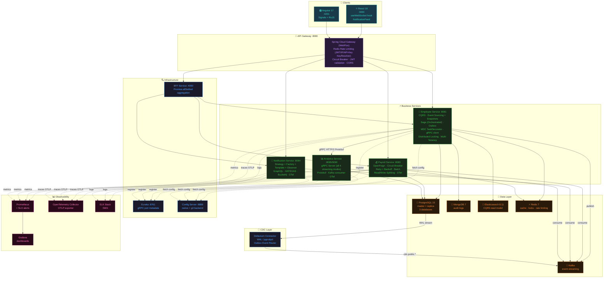

---

## 2. Employee Onboarding — End-to-End Request Flow

```mermaid
sequenceDiagram
    participant C as 👤 Client
    participant GW as 🚪 API Gateway
    participant ES as 👤 Employee Service
    participant SO as 🔄 Saga Orchestrator
    participant GRPC as 📊 Analytics (gRPC)
    participant PS as 💰 Payroll Service
    participant NS as 🔔 Notification Service
    participant K as 📨 Kafka
    participant DB as 🐘 PostgreSQL
    participant OB as 📦 Outbox
    participant WS as 🔌 WebSocket

    C->>GW: POST /api/v1/employees  (Bearer JWT)
    GW->>GW: validate JWT · Redis rate limit (userKeyResolver)
    GW->>ES: route request

    rect rgb(20, 40, 20)
        Note over ES,OB: Atomic Transaction
        ES->>DB: INSERT employee
        ES->>OB: INSERT outbox_event (same txn)
    end

    ES->>SO: startOnboardingSaga(employeeId)
    SO->>PS: POST /api/payrolls (OpenFeign + Circuit Breaker)
    PS-->>SO: 201 Created
    SO->>K: publish EMPLOYEE_CREATED

    ES->>GRPC: RecordEmployeeEvent (Unary gRPC, Protobuf)
    GRPC-->>ES: EmployeeEventResponse (or fallback: log + continue)

    K->>NS: EmployeeEventKafkaConsumer (manual ACK)
    NS->>NS: NotificationStrategyFactory → select channel
    NS->>WS: SimpMessagingTemplate.convertAndSend
    WS-->>C: real-time push (useWebSocket hook)

    ES-->>GW: 201 Created
    GW-->>C: Employee + location header
```

---

## 3. gRPC Communication — All 4 Streaming Modes

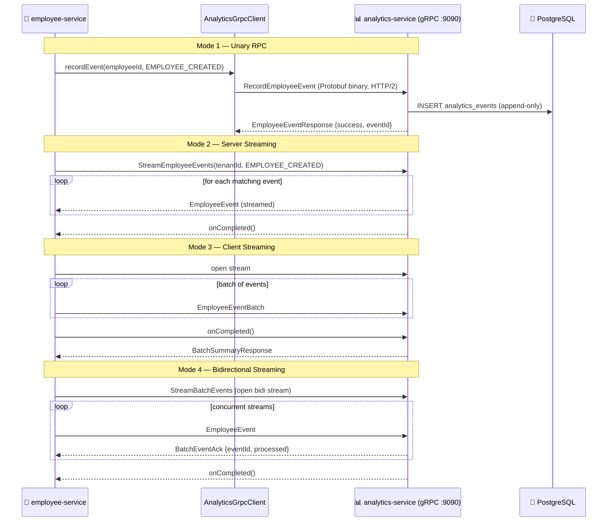

---

## 4. Change Data Capture (CDC) with Debezium

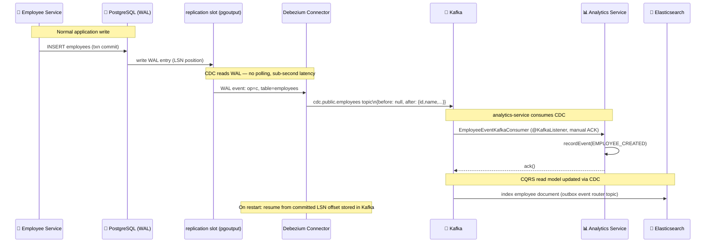

---

## 5. Event Sourcing with Snapshots

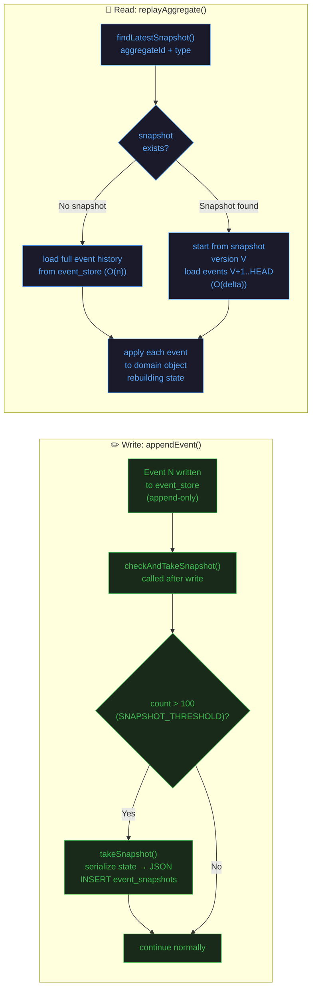

---

## 6. CQRS + Outbox + CDC Data Flow

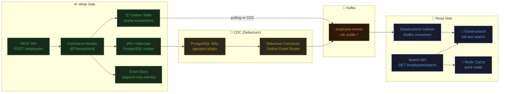

---

## 7. API Gateway — Redis Rate Limiting (3 KeyResolver Strategies)

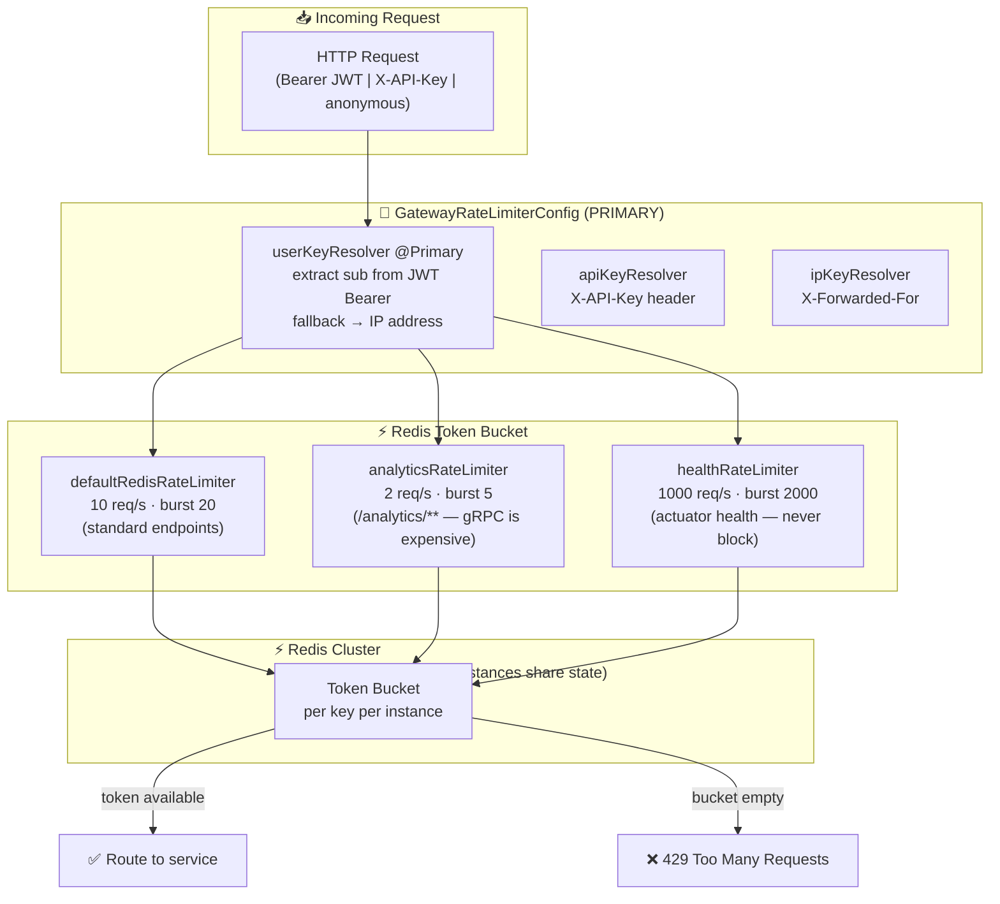

---

## 8. WebSocket Real-Time Notifications

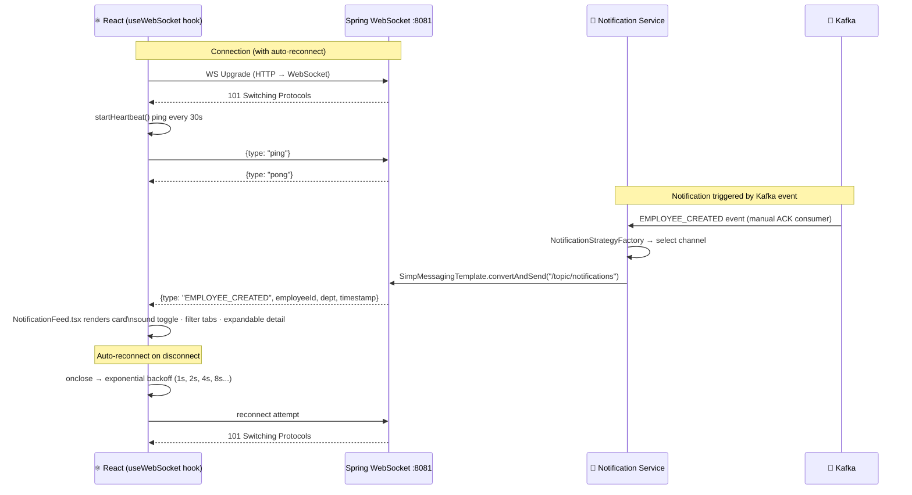

---

## 9. MDC Context Propagation Across Async Threads

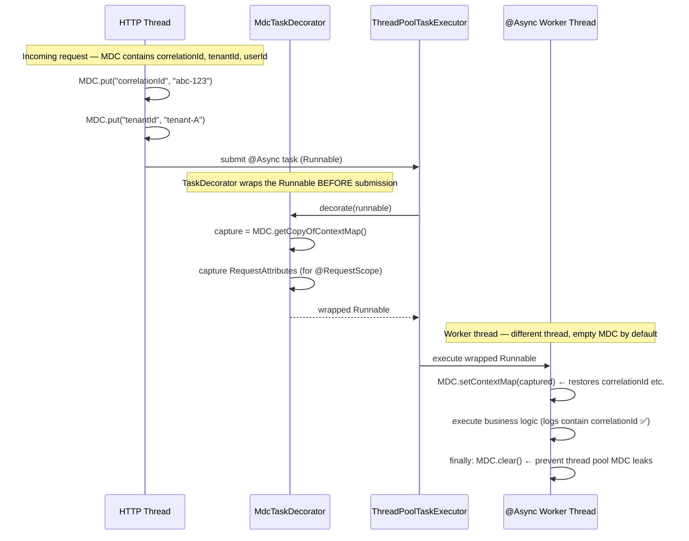

---

## 10. Kubernetes Deployment (with gRPC Ingress)

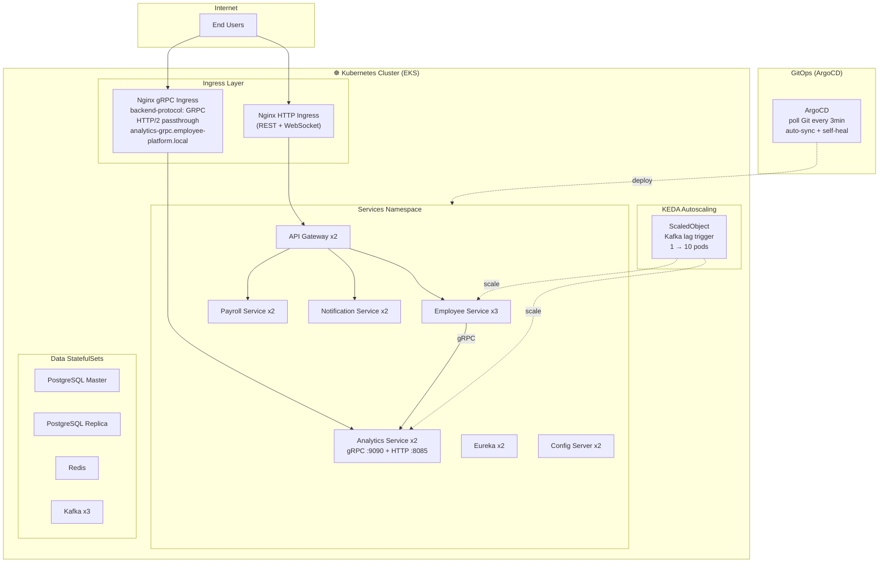

---

## 11. Observability — OpenTelemetry Pipeline

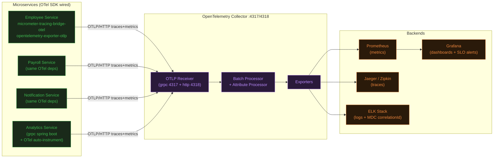

---

## 12. Component Architecture — Employee Service (Detailed)

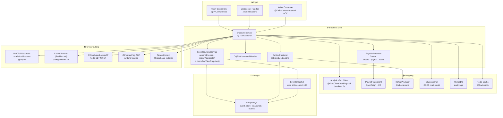

---

*This document is auto-updated. All diagrams reflect actual code in the repository.*
    
    Employee -->|Write| PostgreSQL
    Employee -->|Read| PostgresReplica
    Employee -->|Audit| MongoDB
    Employee -->|Search| ES
    Employee -->|Cache| Redis
    
    Payroll --> PostgreSQL
    Payroll --> Redis
    
    Employee -->|Events| Kafka
    Payroll -->|Events| Kafka
    Kafka --> Zookeeper
    
    Employee -->|Metrics| Prometheus
    Payroll -->|Metrics| Prometheus
    Gateway -->|Metrics| Prometheus
    Prometheus --> Grafana
    
    Employee -->|Traces| Zipkin
    Payroll -->|Traces| Zipkin
    
    Employee -->|Logs| ELK
    Payroll -->|Logs| ELK
```

## Request Flow Sequence

### Employee Creation Flow

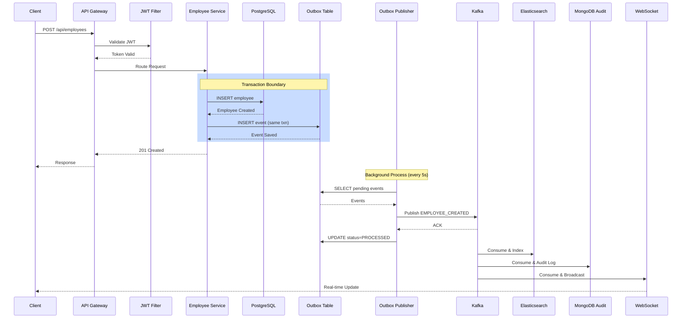

### Saga Pattern: Employee Onboarding

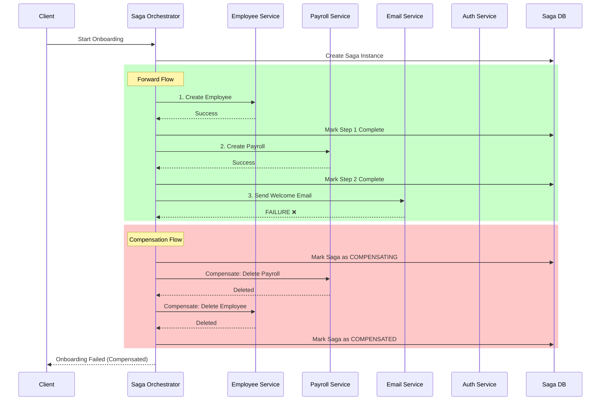

### Database Read/Write Routing

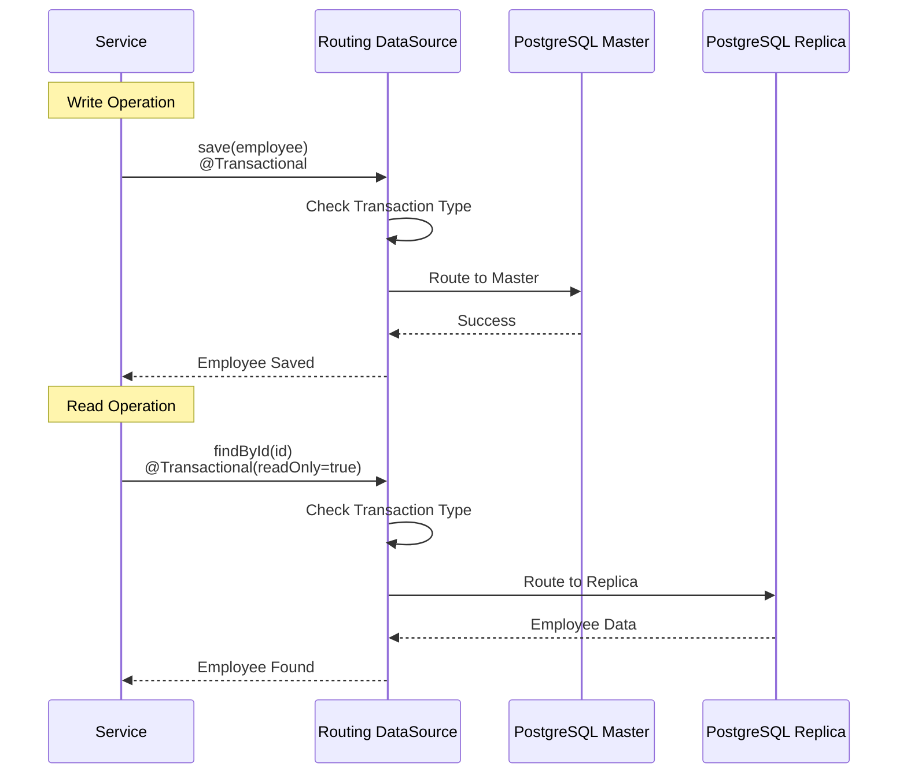

## Component Architecture - Employee Service

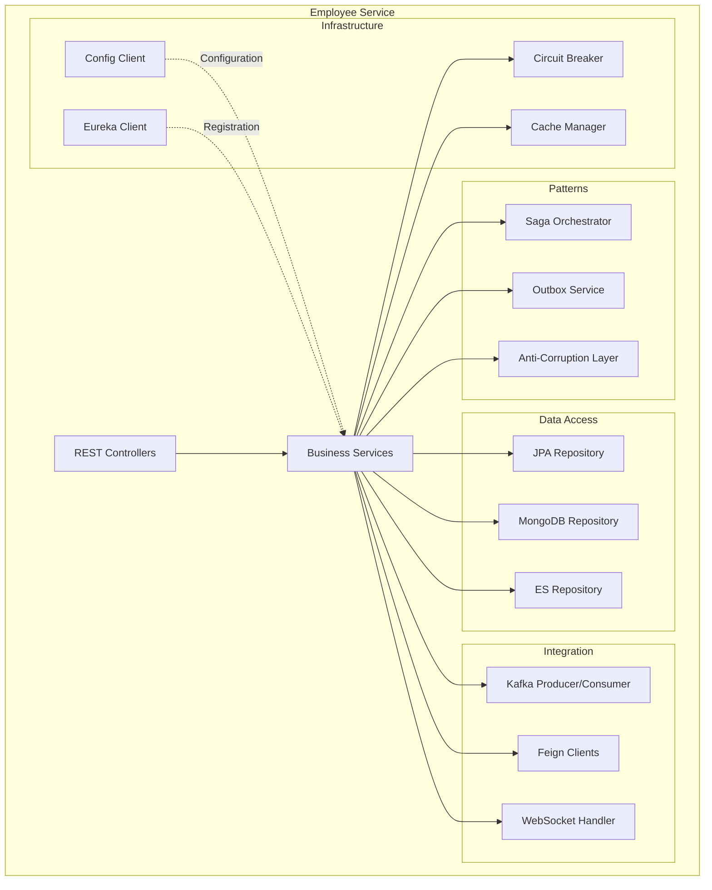

## Deployment Architecture

```mermaid
graph TB
    subgraph "Kubernetes Cluster"
        subgraph "Ingress"
            Ingress[Nginx Ingress Controller]
        end
        
        subgraph "Services Namespace"
            Gateway[API Gateway Pod x3]
            Employee[Employee Service Pod x3]
            Payroll[Payroll Service Pod x3]
            Config[Config Server Pod x2]
            Eureka[Eureka Server Pod x2]
        end
        
        subgraph "Data Namespace"
            PG[PostgreSQL StatefulSet]
            PGReplica[PG Replica StatefulSet]
            Mongo[MongoDB StatefulSet]
            ES[Elasticsearch StatefulSet]
            Redis[Redis StatefulSet]
        end
        
        subgraph "Messaging Namespace"
            Kafka[Kafka StatefulSet x3]
            ZK[Zookeeper StatefulSet x3]
        end
        
        subgraph "Monitoring Namespace"
            Prom[Prometheus]
            Graf[Grafana]
            Zip[Zipkin]
        end
    end
    
    subgraph "External"
        Users[End Users]
        DevOps[DevOps Team]
    end
    
    Users -->|HTTPS| Ingress
    Ingress --> Gateway
    Gateway --> Employee
    Gateway --> Payroll
    
    DevOps -->|Monitoring| Graf
    DevOps -->|Tracing| Zip
```

## Data Flow Architecture

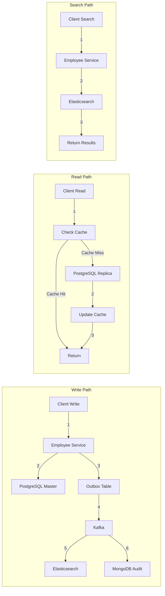

This comprehensive architecture demonstrates:
- **Microservices**: Independent, scalable services
- **Event-Driven**: Kafka for async communication
- **Polyglot Persistence**: Right database for each use case
- **Resilience**: Circuit breakers, retries, fallbacks
- **Observability**: Prometheus, Grafana, Zipkin, ELK
- **Scalability**: Load balancing, read replicas, caching
- **Patterns**: Saga, Outbox, ACL, Strangler Fig
